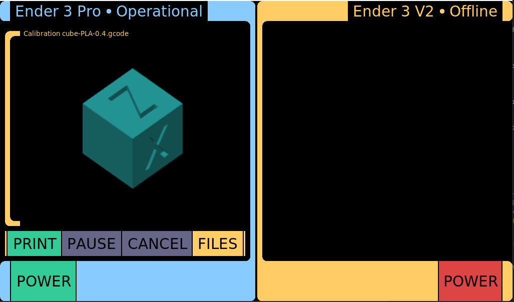

# OctoPyDash

OctoPyDash is an OctoPrint dashboard with an LCARS inspired interface intended to be used with 2+ printers. It is written in Python, with the intent of having minimal non-standard dependencies and as such it should be able to run on just about any system that Python can.

# Requirements

 - Python 3.7+ (tested on Python 3.7 and 3.10)
 - Python modules and their dependencies:
     - requests
     - websockets
     - pillow

# Setup

Setup is simple. A Python virtualenv is optional, but it may make getting the few dependices needed easier.

1. Clone this repository
2. (Optional) in that folder, create a Python virtualenv: `python3 -m venv venv`
3. Install necessary Python modules. If using a venv:
    1. `. venv/bin/active` (activate the venv)
    2. `pip install requests websockets pillow`
4. Open `octopydash/mainwin.py` and change the `self.printer_a = Printer...` line and the following line to specify the names, urls and api keys of your printers.

The dashboard can now be run with `python3 -m octopydash`.

# Notes

This is a work in progress! More tweaks are needed, notably the status text will overlap the frames and there are some other sizing/feedback issues.

The interface should scale to the screen size, however it was originally designed for 1024x600. A larger screen would probably work fine, but a smaller one will need adjustments.

There is an issue with Python 3.7 that causes an unhandled exception during shutdown that is fixed in later versions. It appears that the program runs normally otherwise, however.